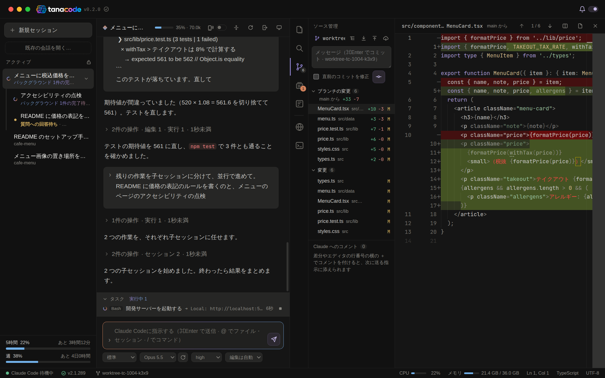

<!-- GitHub のスマホアプリは <picture> でのテーマの切り替えに対応していないので、どちらのテーマでも読める背景付きの 1 枚にする -->
<h1 align="center">
  
</h1>

<h3 align="center">Claude Code の中身が、奥まで見える macOS アプリ</h3>

<p align="center">読んだファイルと覚えているもの、サブエージェントが呼んだツール、ブラウザで確かめた画面まで。<br />中で動くのは、いつもの <code>claude</code> CLI そのもの。</p>

<p align="center">
  <a href="https://github.com/sny-tanaka/tanacode/releases/latest"></a>
  
  <a href="https://github.com/sny-tanaka/tanacode/actions/workflows/claude-code-check.yml"></a>
  
</p>

<p align="center">
  <a href="https://sny-tanaka.github.io/tanacode/"><b>ブラウザでデモを試す</b></a> ・
  <a href="#インストール"><b>インストール</b></a> ・
  <a href="GUIDE.md"><b>使い方</b></a>
</p>

Claude Code（`claude` CLI）と IDE をひとつにしたデスクトップアプリ。Claude に任せている間も、何を読んで何を覚えているか、サブエージェントが中で何をしているか、画面で何を確かめたかを、チャットの横に表示します。コードを書くのは Claude に任せて、あなたは確認と小さな修正だけ。

<sub>個人が作っている非公式のツール。Anthropic の公式製品ではなく、Anthropic の承認や支援も受けていません。</sub>

<p align="center">
  
</p>

## まずはブラウザで

インストールせずに、[デモ](https://sny-tanaka.github.io/tanacode/)で実際の画面を操作できます。ひとつのセッションの作業を始めから終わりまで追う、8 章のツアー。1 章だけ見るなら、[Claude が知っている範囲](https://sny-tanaka.github.io/tanacode/#knowledge)がおすすめです。

1. [セッションを始める](https://sny-tanaka.github.io/tanacode/#start)
2. [指示して任せる](https://sny-tanaka.github.io/tanacode/#delegate)
3. [Claude が知っている範囲](https://sny-tanaka.github.io/tanacode/#knowledge)
4. [ブラウザで確かめる](https://sny-tanaka.github.io/tanacode/#browser)
5. [レビューして直す](https://sny-tanaka.github.io/tanacode/#review)
6. [並行して進める](https://sny-tanaka.github.io/tanacode/#parallel)
7. [整理して振り返る](https://sny-tanaka.github.io/tanacode/#wrapup)
8. [アプリのまわり](https://sny-tanaka.github.io/tanacode/#app)

<sub>デモは作り物のデータで動くため、本物の Claude には繋がりません。</sub>

## 中身が見える

### Claude が何を読み、何を覚えているか

今の会話で Claude が読んだファイルは青、書いたファイルは橙の点をエクスプローラーに。圧縮で要約に置き換わったファイルは白抜きの点で区別。コンテキストの使用量はヘッダーのメーターに。中身は、読んだファイル・ツールの結果・サブエージェントの結果などに分けて、およその大きさの帯付きで一覧にします。残すもの・捨てるものを選んで圧縮することも。hooks の出力と止めた理由は、編集のカードの下に表示します。

[デモで見る →](https://sny-tanaka.github.io/tanacode/#knowledge)

### サブエージェントとワークフローが、中で何をしているか

サブエージェント・ワークフロー・バックグラウンドの Bash は、動いている間は入力欄の上に並び、そこから止めることもできます。開くと、エージェントごとの会話をツールの呼び出しまで含めて表示。ワークフローは、フェーズとエージェントの流れを図にして、どのエージェントが何をしたかを 1 つずつ追えます。

[デモで見る →](https://sny-tanaka.github.io/tanacode/#parallel)

### 画面で何を見て、何を確かめたか

開発中のページをアプリの中で表示。クリックで選んだ要素のセレクタ・HTML・切り出した画像を、そのまま Claude への指示に添付。コンソールのエラーも、ボタン 1 つで入力欄へ。直したあとは、Claude も同じブラウザでページを開き、スクリーンショット・コンソール・クリックで自分で確認します。押す前の要素には橙の枠が出るので、何をしているかが見えます（MCP。別に入れるものは無し。開けるのは localhost などの開発用の先だけ）。ログインなど Claude にできない操作は、作業の途中であなたに依頼。済んだらボタンを押すだけで、Claude が続きから再開します。

[デモで見る →](https://sny-tanaka.github.io/tanacode/#browser)

## いつもの Claude Code のまま

- 中で動くのは、インストール済みの `claude` CLI そのもの。スキル・CLAUDE.md・hooks・MCP の設定が**そのまま有効**
- アプリを閉じても **Claude Code は動いたまま**。Remote Control でスマホからも続行可能
- Claude Code の設定（`~/.claude/settings.json` など）への**書き込みは無し**。tanacode 自身が情報を外へ送る仕組みも無し
- 最新の Claude Code で動くかを**毎日自動で確認**。入っている Claude Code が動作確認済のバージョンと違えば、ステータスバーの印でお知らせ
- ターミナルで始めた会話も**取り込み可能**

## ほかにも

- **任せている間の表示**: ツールの操作は 1 行に畳んで表示。質問や許可の確認には、チャットのボタンで回答（[デモ](https://sny-tanaka.github.io/tanacode/#delegate)）
- **プッシュ前のレビュー**: ブランチが分岐したところからの変更（コミット済みも含む）を、プルリクエストのような一覧で確認。差分の行に付けたコメントは、次の指示に添えて Claude へ（[デモ](https://sny-tanaka.github.io/tanacode/#review)）
- **並行して進める**: セッションの状態（作業中・完了待ち・質問への回答待ち・新しい応答）を一覧の印で区別し、見ていないセッションの完了や確認は macOS の通知で。セッションごとに `claude --worktree` で作業フォルダとブランチを分け、`node_modules` の準備まで tanacode が受け持ちます。親のセッションの Claude が、子のセッションに作業を分けて指示することも（[デモ](https://sny-tanaka.github.io/tanacode/#parallel)）
- **Claude と一緒に使うチェックリスト**: やること・満たすべき条件・人のやること・確認事項など、名前を付けたリストをセッションごとに。会話とは別に残るので、圧縮されても消えません。Claude は MCP で読み書きし、確かめたものにチェック。カードへの返信はスレッドになり、Claude に知らせることも。別のセッションへのコピーも（[使い方](GUIDE.md#チェックリスト)）
- **ウォークスルー**: 画面共有でのコードレビューのように、Claude がエディタにコードを開いて示しながら、変更の意図を説明。あなたは「次へ」で自分のペースで進め、気になった行を選んでその場で質問。説明は、コードを埋め込んだ 1 つのコメントとして GitHub の PR にも残せます（[使い方](GUIDE.md#ウォークスルーclaude-によるコードの説明)）
- **時刻を指定して送信**: 書いた指示を、決めた時刻に送る予約（Slack の予約投稿のように）。時刻になったら、Claude Code の手が空くのを待って送ります
- **整理と振り返り**: 英語などで返ってきた思考と応答は、ボタン 1 つで日本語に翻訳（macOS 標準の翻訳で Mac の中で訳すので、外へは送りません。macOS 15 以降）。作業の流れは、チャットと同じ見た目の 1 枚の HTML に書き出せます（[デモ](https://sny-tanaka.github.io/tanacode/#wrapup)）
- **利用枠とアプリのまわり**: 5 時間枠と週の枠の使用率とリセットまでの時間、この Mac の CPU とメモリの使用量を常に表示。tanacode の新しいバージョンが出たときは、タイトルバーの印で分かります（[デモ](https://sny-tanaka.github.io/tanacode/#app)）

このほか、会話を続けたまま Claude Code だけを再起動する機能、Monaco エディタ・ターミナル・git の操作など。詳しくは [GUIDE.md](GUIDE.md) へ。

## 必要なもの

- macOS 13 以降（Apple Silicon・Intel）
  - チャットの翻訳だけは macOS 15 以降（macOS 標準の翻訳を使うため）
- [Claude Code](https://code.claude.com/docs)（`claude` CLI）
  - ターミナルで一度 `claude` を起動し、初回のセットアップ（テーマの選択とログイン）を済ませておきます
  - tanacode で動作確認済のバージョンは 2.1.293。違うバージョンのときは、ステータスバーのバージョンに警告の印が付きます（マウスを乗せると理由を表示）
  - 最新の Claude Code で動くかも、毎日自動で確認。それでも Claude Code の更新で、一部の表示や操作が動かなくなる場合あり

## インストール

### Homebrew（おすすめ）

```bash
brew install --cask sny-tanaka/tanacode/tanacode
```

[Homebrew](https://brew.sh/) で入れると、新しいバージョンをアプリが自分で入れられます（下の「更新」）。[Releases](https://github.com/sny-tanaka/tanacode/releases) の zip を、その Mac（Apple Silicon・Intel）に合わせて入れます。Apple の署名が無くても、macOS の警告は出ません。tap（[sny-tanaka/homebrew-tanacode](https://github.com/sny-tanaka/homebrew-tanacode)）の cask が、インストールと更新のたびに tanacode.app だけからダウンロードの印（quarantine 属性）を外すため。下の zip の手順の `xattr` と同じことを、Homebrew が代わりに行います。

### ビルド済みのアプリ（Releases）

[Releases](https://github.com/sny-tanaka/tanacode/releases) から、Mac に合ったものをダウンロード。

| Mac | ファイル |
| --- | --- |
| Apple Silicon（M1 以降） | `tanacode-<バージョン>-mac-arm64.pkg`（または `.zip`） |
| Intel | `tanacode-<バージョン>-mac-x64.pkg`（または `.zip`） |

> **署名について**
>
> 個人で作っているため、Apple の署名・公証は未取得（自己署名の証明書で署名）。初回だけ macOS の警告が出るので、次の手順で許可します。
>
> 署名はバージョンが変わっても同じ証明書です。更新しても同じアプリとして扱われるので、一度許したフォルダへのアクセスや通知などの許可は残ります。

<details>
<summary>インストーラー（pkg）で入れる場合</summary>

1. pkg を開きます。Apple の署名・公証がないので、初回は「開けません」「Apple は検証できませんでした」などと出るため、「完了」で閉じます
2. システム設定 →「プライバシーとセキュリティ」の下の方にある、tanacode の「このまま開く」を押します
3. インストーラーの手順に沿って進めます（途中で Mac のパスワードを入力）。「アプリケーション」フォルダに入ります

インストーラーで入れたアプリはダウンロードの印が付かないので、そのまま起動できます。

</details>

<details>
<summary>zip で入れる場合</summary>

1. zip を開き、`tanacode.app` を「アプリケーション」フォルダへ移します
2. Apple の署名・公証がないので、そのままでは「壊れているため開けません」などと出て起動できません。一度だけ、ターミナルで次のコマンドを実行してダウンロードの印を外します

   ```bash
   xattr -dr com.apple.quarantine /Applications/tanacode.app
   ```

   このコマンドは、tanacode.app だけから、macOS がダウンロードしたアプリに付ける実行前の確認の印（quarantine 属性）を外すもの。Releases 以外から手に入れたファイルには使わないでください。

</details>

### ソースからビルド

手元でビルドしたアプリにはダウンロードの印が付かないので、Apple の署名が無くても macOS の警告は出ません。

必要なもの: Node.js 22・git・Xcode Command Line Tools（チャットの翻訳に使う `swiftc`。無くてもビルドでき、翻訳のボタンが出ないだけ）

```bash
git clone https://github.com/sny-tanaka/tanacode.git
cd tanacode
npm install
npm run install-app
```

ビルドして `/Applications/tanacode.app` に入れます。Apple Silicon・Intel のどちらでも、その Mac に合わせて作ります。

### 更新

新しいバージョンが出ると、タイトルバーのバージョンの右に青いダウンロードの印が出ます（GitHub の Releases を 1 時間ごとに確認）。リポジトリの Watch → Custom → Releases でも通知を受け取れます。

- **Homebrew で入れた場合**: 自動で更新。新しいバージョンを見つけると、裏で `brew update` と `brew fetch` を実行してダウンロードだけを済ませ、タイトルバーに「再起動して更新」を出します。
  - 「再起動して更新」を押すと、tanacode を終了し、Homebrew で入れ替えてから起動し直します。Claude Code が動いているセッションがあれば、動かしたまま更新するか、止めて更新するかを選べます。動かしたまま更新すると、新しいバージョンで増えた Claude のツールなどは、各セッションをチャットのヘッダーの「再起動」で起動し直してから使えます
  - 押さなくても、ふつうに終了したときに入れ替えます（次に起動すると新しいバージョン）。止めるときは、メニューの「tanacode → 終了するときに新しいバージョンを入れる（Homebrew）」のチェックを外します
  - 入れ替えるのは、tanacode が終わってから。動いているアプリの中身は入れ替えません。Homebrew の確認（y/n）は出さずに進めます
  - 入れ替えられなかったときは、次の起動で理由を知らせます。macOS に止められた場合は、システム設定 →「プライバシーとセキュリティ」→「アプリケーションの管理」で tanacode を許可します
  - 手で更新するときは、メニューの「ファイル → Claude Code も止めて終了」で終了してから、次を実行します

    ```bash
    brew update && brew upgrade --cask tanacode
    ```

    `brew update` は、手元の tap を新しくするためのもの。tap の cask は、新しいバージョンの公開の数分あとに新しくなります。Homebrew の自動更新は 24 時間に 1 回（`HOMEBREW_NO_AUTO_UPDATE` で止めていると、`brew update` を実行するまで新しくなりません）なので、公開の直後は、`brew upgrade` だけだと「最新です」と出ることがあります

- **ビルド済みのアプリの場合**: 新しいバージョンを入れる前に、メニューの「ファイル → Claude Code も止めて終了」で終了します。アプリの入れ替えで、動いている Claude Code が途中で切れないようにするためです

- **ソースから入れた場合**: 次を実行してから tanacode を終了し、終了のダイアログで「動かしたまま終了」を選んで起動し直します。動いている Claude Code は止まらず、新しいバージョンがそのまま引き継ぎます

  ```bash
  git pull
  npm install
  npm run install-app
  ```

### アンインストール

メニューの「ファイル → Claude Code も止めて終了」で終了してから、次を削除。

- `/Applications/tanacode.app`
- `~/Library/Application Support/tanacode/`

Homebrew で入れた場合は、終了してから `brew uninstall --cask --zap tanacode` で、両方を消せます。

Claude Code の会話ログ（`~/.claude/`）は Claude Code のものなので残ります。

## ドキュメント

| 読むもの | 内容 |
| --- | --- |
| [GUIDE.md](GUIDE.md) | はじめの一歩・画面の見方・機能ごとの使い方・ショートカット・データの扱い・制限・困ったとき |
| [CONTRIBUTING.md](CONTRIBUTING.md) | ソースからのビルド・貢献の流れ・仕組み・ソースの構成 |

不具合・要望は [Issues](https://github.com/sny-tanaka/tanacode/issues) へ。

画面と文書は日本語のみ。英語対応は検討中のため、要望があれば [Issues](https://github.com/sny-tanaka/tanacode/issues) へ。

## ライセンス

[MIT](LICENSE)

同梱している依存のライセンスは、アプリの `Contents/Resources/THIRD_PARTY_NOTICES.txt` を参照。

<sub>「Claude」「Claude Code」は Anthropic, PBC の商標。</sub>
